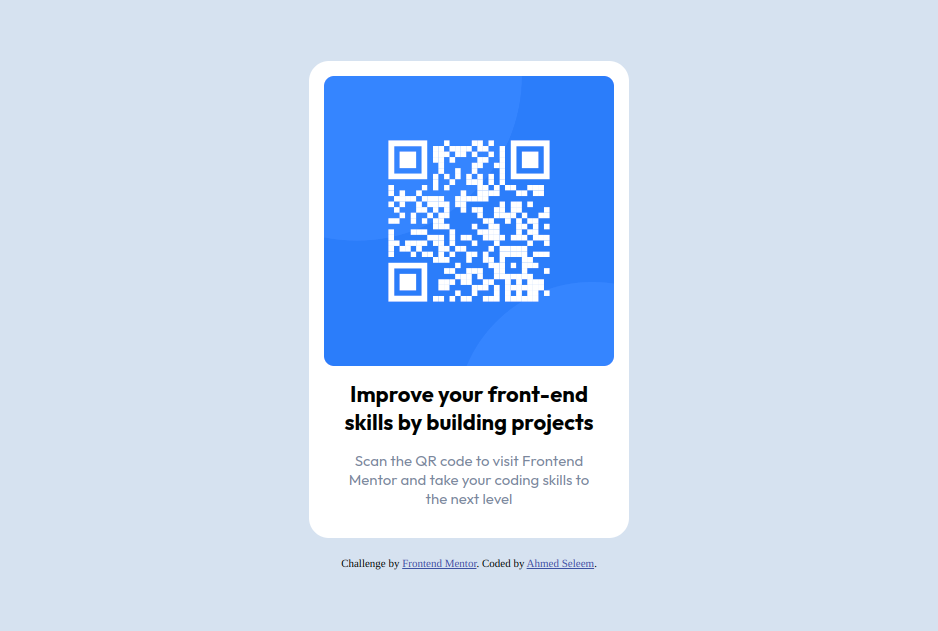

# Frontend Mentor - QR code component solution

This is a solution to the [QR code component challenge on Frontend Mentor](https://www.frontendmentor.io/challenges/qr-code-component-iux_sIO_H). Frontend Mentor challenges help you improve your coding skills by building realistic projects. 

## Table of contents

- [Overview](#overview)
  - [Screenshot](#screenshot)
  - [Links](#links)
- [My process](#my-process)
  - [Built with](#built-with)
  - [What I learned](#what-i-learned)
- [Author](#author)

## Overview

### Screenshot



### Links

- Solution URL: [Solution](https://github.com/Ahmed-Seleem01/QR-code)
- Live Site URL: [Live site](https://ahmed-seleem01.github.io/QR-code/)

## My process

### Built with

- HTML5
- CSS
- Flexbox
- Mobile-first workflow

### What I learned

Control how easily any element is positioned by setting its container  
to display flexbox.

Align any element vertically using flexbox

```css
.container{
  display: flex;
  flex-direction: column;
  align-items: center;
  justify-content: center;
  ...
}
```
## Author

- Frontend Mentor - [@Ahmed Seleem](https://www.frontendmentor.io/profile/yourusername)
